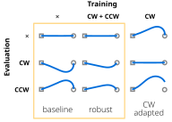

This post demonstrates the extended Markdown features available in this blog.

## Basic Formatting

You can use **bold**, *italic*, and ~~strikethrough~~ text.

## Lists

Unordered list:
- Item 1
- Item 2
- Item 3

Ordered list:
1. First item
2. Second item
3. Third item

Task list:
- [x] Completed task
- [ ] Incomplete task

## Code

Inline code: `const greeting = "Hello, world!";`

Code block with syntax highlighting:

```javascript
function greet(name) {
  return `Hello, ${name}!`;
}

console.log(greet("Reader"));
```

## Tables

| Name  | Age | Occupation    |
|-------|-----|---------------|
| Alice | 28  | Developer     |
| Bob   | 32  | Designer      |
| Carol | 45  | Product Owner |

## Blockquotes

> This is a blockquote.
> 
> It can span multiple lines.

## Math Equations

Inline math: $E = mc^2$

Display math:

$$
\frac{d}{dx}(e^x) = e^x
$$

## Sidenotes

You can add sidenotes[^1] to provide additional context without interrupting the flow of your main text. These appear in the right margin on larger screens[^2] and become toggleable on mobile devices.

## Custom Callouts

### Basic Callouts

> [!note]
> This is an informational callout using the standard Obsidian syntax.

> [!warning]
> This is a warning callout that draws attention to important information.

> [!danger]
> This is an error/danger callout for critical warnings.

> [!tip]
> This is a success/tip callout for helpful information.

### Callouts with Titles

> [!info] Pro Tip
> You can add custom titles to callouts to make them more descriptive and organized. The title supports **markdown formatting** too!

> [!warning] Important Notice
> Titled callouts help readers quickly understand the purpose of the callout and provide better organization of content.

### Collapsible Callouts

> [!note]- Additional Reading
> This callout can be collapsed to save space (note the minus sign after the type). It's perfect for optional content like detailed explanations, additional resources, or lengthy examples that readers can choose to view.
> 
> You can include any markdown content here:
> - Lists with **bold text**
> - `Code snippets`
> - [Links](https://example.com)
> - And much more!

> [!tip]+ Advanced Features
> This callout uses the plus sign, which means it's collapsible but starts expanded by default. This is great for content that's important but can be hidden if needed.
>
> The syntax is simple:
> - `[!type]` - regular callout
> - `[!type]-` - collapsible, starts collapsed
> - `[!type]+` - collapsible, starts expanded

## Tabs

::::tabs
:::tab{label="React"}
Babbo of the babbo
```js
// React example
```
:::
:::tab{label="Vue"}
```js
// Vue example
```
:::
::::

## Links

[External link](https://example.com)

[Internal link](/blog/hello-world)

## Images

You can include images like this:




## Horizontal Rule

---

That's it! You now have a reference for all the extended Markdown features available in this blog.

[^1]: This is an example sidenote! It provides additional information without cluttering the main text. Unlike traditional footnotes, sidenotes appear in the margin next to the relevant text.

[^2]: The sidenotes automatically adapt to different screen sizes. On mobile devices, they become toggleable by tapping the sidenote number.
